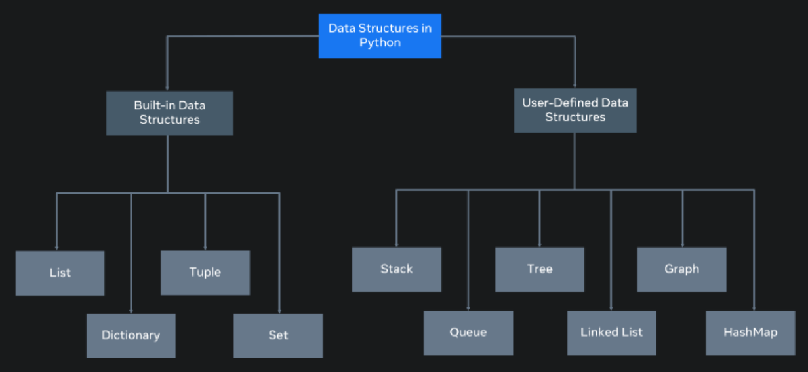

# What are data structures

What happens if you need to work with more complex information, such as a collection of data like a list of people or a list of companies?

Data structures are designed for this very purpose.

A data structure allows you to organize and arrange your data to perform operations on them. Python has the following built-in data structures: `List`, `dictionary`, `tuple` and `set`. These are all considered `non-primitive data structures`, meaning they are classed as objects

Along with the built-in data structures, Python allows users to create their own. Data structures such as `Stacks`, `Queues` and `Trees` can all be created by the user. 

Each data structure can be designed to solve a particular problem or optimize a current solution to make it much more performant.

### Mutability and Immutability

Data Structures can be mutable or immutable. 

`Mutability` refers to data inside the data structure that can be modified. For example, you can either change, update, or delete the data when needed. A `list` is an example of a mutable data structure.

`Immutability` refers to data structure that cannot be modified. The tuple is an example of an `immutable` data structure